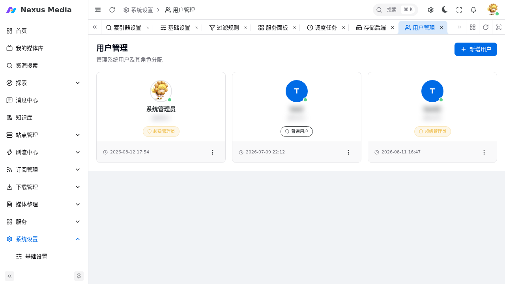

# 用户与权限

系统采用 RBAC（基于角色的访问控制）模型：**用户** 分配到 **角色**，角色绑定 **菜单/操作权限**。入口：**系统设置** 下的用户管理、角色管理、菜单管理、API Key 管理。

多用户数据权限采用三层模型（详见 [ADR-021](decisions/ADR-021-multi-user-data-permission.md)）：

| 层 | 作用 | 机制 |
|----|------|------|
| L1 功能权限 | 能做什么操作 | 权限码（如 `subscription:manage`），挂在角色 |
| L2 数据归属 | 能看哪些数据行 | `USER_ID` 行级过滤，A/B 用户订阅、搜索、下载历史互不可见 |
| L3 站点授权 | 能用哪些站点 | 角色级 + 用户级站点授权（`search`/`rss` 用途粒度） |

**管理员判定**：角色码 `superadmin`（唯一全量可见角色），非权限码。

## 用户管理

入口：**系统设置 → 用户管理**（`/system/users`）。管理系统用户及其角色分配。

{ .screenshot }

| 操作 | 说明 |
|------|------|
| 新增用户 | 创建用户，设置用户名、密码、角色 |
| 编辑 | 修改角色分配、重置密码 |
| 启用/停用 | 停用后该用户无法登录 |

!!! warning "安全提示"
    默认管理员 `admin` 首次登录后**必须修改默认密码**，并为用户分配最小必要角色。

## 角色管理

入口：**系统设置 → 角色管理**（`/system/roles`）。角色是权限的集合：

- 内置角色：**超级管理员**（全部权限）、**普通用户**（基础权限）
- 新增角色时勾选该角色可访问的菜单与操作权限
- 修改角色权限后，属于该角色的用户即时生效

## 菜单管理

入口：**系统设置 → 菜单管理**（`/system/menus`）。管理系统菜单结构，一般无需修改；可控制菜单的显示顺序、可见性，并维护角色对应的菜单权限。

## API Key 管理

入口：**系统设置 → API Key 管理**（`/system/apikey`）。为外部调用开放 API 访问：

- 创建 API Key 并指定权限与有效期
- 启用后，外部请求需在 URL 携带 `?apikey=xxx` 或请求头 `Authorization`

!!! note
    消息渠道（Telegram / 企业微信等）的外部访问 IP 白名单在 [通知设置](notifications.md#交互安全ip-白名单) 中按渠道配置。

### API 文档（Scalar）

后端使用 **Scalar** 提供交互式 API 文档，需在 [基础配置 → 系统](configuration.md#系统) 开启 **DEBUG 模式**（默认关闭）后访问：

- 后端直连：`http://<后端地址>:3000/docs`
- 经前端反代：`http://<访问地址>:8080/docs`

文档支持在线调试所有接口（需携带 API Key 或登录态），便于对接外部系统、排查接口问题。生产环境务必保持 DEBUG 关闭。

!!! note
    DEBUG 模式默认关闭（`config.yaml` 的 `app.debug: false`）；关闭后 `/docs` 返回 404。

## 系统日志

入口：**日志**（`/logs`）。查看系统运行日志，用于排障：

- 按级别过滤（DEBUG / INFO / WARNING / ERROR），排障时可在 [基础设置 → 日志](configuration.md#日志) 临时调高日志级别
- 支持按关键字搜索、按时间范围查看
- 刷流、订阅、转移等各功能的关键事件均有日志输出

## 常见问题

**用户无法登录**

1. 确认账号已启用
2. 确认密码正确（忘记可联系管理员重置）
3. 确认网络访问来源在白名单内（如配置了外部访问控制）

## 站点授权

站点可见性支持**角色级**（批量）与**用户级**（例外补充）两级，纯并集，无拒绝语义：

- **角色站点授权**：角色管理页 → 盾牌图标 → 勾选站点与用途（搜索 / RSS）
- **用户站点授权**：用户管理页 → 操作菜单「站点授权」 → 勾选站点与用途
- 权限码 `site:assign` 控制授权入口的可见与调用

可见性规则：`superadmin` 全量；`site_grant_default_policy = closed` 时普通用户仅可见被授权站点（`open` 为默认，不过滤，兼容单用户）。站点数据（做种/上传下载/魔力值/历史）同样按可见站点裁剪，用户看不到未授权站点的共享账号数据。

!!! note "第三方索引器"
    授权键支持 `jackett:<站点名>` / `prowlarr:<站点名>` 精确授权，或 `jackett:*` / `prowlarr:*` 整体授权。

## 渠道绑定（个人通知）

入口：**个人设置 → 渠道绑定**。用户把自己的 IM/推送身份绑定到系统账号：

- **交互渠道**（Telegram / 企业微信 / Slack / 飞书）：生成 6 位绑定码（10 分钟有效），在 IM 中发送 `/bind <绑定码>` 完成绑定
- **推送渠道**（Bark / Ntfy / Gotify / Server酱 / PushPlus / PushDeer / 钉钉 / Chanify）：在 Web 端登记自己的推送 Key
- 订阅完成、下载开始/入库等**归属事件**按绑定定向推送；未绑定用户仅收 Web 消息，未绑定 IM 用户被拒绝交互

!!! warning
    全局消息渠道配置（系统设置 → 通知）接收系统级事件；个人绑定只接收自己的事件，两者独立。Telegram 存量 `admin_ids` 会在启动时自动绑定到第一个超级管理员，其他渠道需管理员手动绑定一次。

## 多用户使用流程

### 管理员：为成员开通访问

1. **创建用户**：系统设置 → 用户管理 → 新增用户，设置用户名/密码
2. **分配角色**：编辑用户 → 勾选角色（如「普通用户」；该角色默认只有基础权限）
3. **授予站点**（关键）：
   - 批量：角色管理 → 盾牌图标 → 勾选站点与用途（搜索 / RSS）
   - 个别例外：用户管理 → 操作菜单「站点授权」 → 补充授权
4. **验证隔离**：用该用户登录，确认只能搜到/订阅被授权站点，订阅列表只显示自己的

!!! tip "站点授权策略"
    默认 `open` 策略下所有站点对所有用户开放（兼容单用户）。要启用白名单，需将系统配置 `SiteGrantDefaultPolicy` 设为 `closed`，之后普通用户仅能看到被授权的站点。

### 成员：绑定通知渠道

个人设置 → 渠道绑定，交互渠道发送 `/bind <绑定码>`、推送渠道登记自己的 Key。详见 [通知渠道配置 → 个人渠道绑定](notifications.md#个人渠道绑定多用户)。

### 权限码速查（本功能新增）

| 权限码 | 用途 |
|--------|------|
| `site:assign` | 站点授权入口（角色/用户授权） |
| `user:self` | 用户自助（改自己密码/头像、管理自己的 API Key） |
| `download:create` | 发起/控制下载任务（不含下载器配置） |
| `transfer:view` | 查看转移历史 / 未识别列表（默认仅管理员） |

## 常见问题

| 现象 | 排查 |
|------|------|
| 用户看不到任何站点 | 站点授权策略是否为 `closed` 且未授权；或角色缺少 `site:view`/搜索权限 |
| 用户能看到别人的订阅 | 该用户角色是否为 `superadmin`（超管全量可见）；或数据异常，检查角色配置 |
| 用户不能发起下载 | 角色需含 `download:create`（下载器配置另需 `download:manage`，不建议授予普通用户） |
| 用户看不到转移历史 | 正常：转移历史/未识别列表需 `transfer:view` 或 `library:manage` |
| 修改角色权限后未立即生效 | 权限有 60 秒快照缓存，变更会主动失效；若仍异常请重新登录 |
| IM 发消息无响应 | 该 IM 账号未完成绑定；管理员可在渠道绑定列表确认 |
